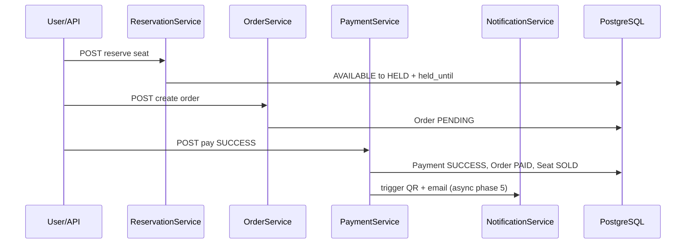

# Architecture Decision Document — Ticketing System

Tài liệu này ghi các quyết định kỹ thuật để agent và dev triển khai **nhất quán**.

**Kiểu kiến trúc:** **Monolith phân tầng (3-tier / layered)** — `controller` → `service` → `repository` → `entity`. Không dùng package-by-domain; không phải MVC (không có View). Chỉ tách microservice khi đạt Gate A (sau E3), roadmap 10 phase.

---

## Project Context Analysis

### Requirements Overview

**Functional Requirements (từ Mini PRD):**

| FR | Ý nghĩa kiến trúc |
|----|-------------------|
| FR-01 | `EventController` + `EventService` — read API công khai, admin CRUD |
| FR-02 | `Seat` / `TicketType` entities + `ReserveService` — hai chế độ inventory |
| FR-03–04 | `ReserveService`, `OrderService` — transaction, state `HELD` / `PENDING` |
| FR-05–06 | `PaymentService` — fake provider phase 3, idempotency key bắt buộc |
| FR-07–08 | `NotificationService` — stub phase 3, RabbitMQ consumer phase 5 |
| FR-09 | `AdminEventController` + `EventService`; bảo vệ role phase 4 |

**Non-Functional Requirements:**

- **Correctness > performance** — locking, transaction boundary, audit trail
- **Concurrency** — không double-book; test song song từ phase 2
- **Audit** — bảng lịch sử trạng thái order/payment
- **Testability** — integration test với Testcontainers (PostgreSQL)

**Scale & Complexity:**

- Primary domain: **API backend** (REST), không có UI trong MVP
- Complexity: **medium** (state machine + concurrency + lộ trình phân tán sau)
- ~10 epics, evolution từ monolith → messaging → microservices → saga

### Technical Constraints & Dependencies

- Dự án học tập: mỗi phase một demo flow, không nhồi công nghệ sớm
- Phase 1–3: **một app Spring Boot, một PostgreSQL**
- Phase 4+: JWT; Phase 5+: RabbitMQ; Phase 6+: Kafka; Phase 7+: Redis lock; Phase 8+: tách service
- `pom.xml` hiện tại là skeleton Maven — **thay bằng Spring Boot** ở E1-S1

### Cross-Cutting Concerns

- State machine Ticket / Order / Payment
- Transaction & locking (DB → Redis ở phase 7)
- Scheduled expire hold
- Idempotent payment callback
- API error handling thống nhất
- Correlation / request ID logging (phase 6+)
- OpenAPI documentation

---

## Starter Template Evaluation

### Lựa chọn

**Spring Initializr** — `spring-boot-starter-parent` **3.5.14** (stable, 2026).

| Thành phần | Phiên bản / lựa chọn |
|------------|----------------------|
| Java | **21 LTS** (khuyến nghị; thay `26` trong `pom.xml` hiện tại) |
| Build | Maven |
| Dependencies khởi tạo | `web`, `data-jpa`, `validation`, `flyway-core`, `postgresql`, `lombok`, `spring-boot-starter-test`, `testcontainers` (test scope) |
| API docs | `springdoc-openapi-starter-webmvc-ui` **2.8.x** (tương thích Boot 3.5) |
| Phase 4+ | `spring-boot-starter-security`, JWT (jjwt **0.12.x**) |
| Phase 5+ | `spring-boot-starter-amqp` |
| Phase 6+ | `spring-kafka` |
| Phase 7+ | `spring-boot-starter-data-redis`, Redisson hoặc Spring Integration lock |

**Lý do:** Bám stack PRD (Java, Spring Boot, JPA, scheduler, email/payment sau), hệ sinh thái mature, phù hợp `user_skill_level: intermediate`.

**Khởi tạo (E1-S1):**

```bash
# Hoặc dùng start.spring.io với các dependency ở trên
groupId: com.ezticket
artifactId: ticketing-system
package: com.ezticket
```

---

## Core Architectural Decisions

### Decision Priority Analysis

**Critical (chặn implementation nếu thiếu):**

1. Monolith **layered** — `controller` / `service` / `repository` / `entity`
2. PostgreSQL + Flyway migrations
3. Entity model & state machine
4. Locking strategy cho reserve
5. REST + envelope lỗi chuẩn
6. Transaction boundaries (`@Transactional` trên **service**)

**Important (định hình kiến trúc):**

- Controller mỏng; business logic chỉ trong `service`
- Fake payment contract
- Scheduler expire hold (`scheduler` package)
- Audit tables

**Deferred (theo roadmap):**

- JWT (E4), RabbitMQ email (E5), Kafka events (E6), Redis lock (E7), microservices (E8), Saga (E9), Docker CI (E10)

### Data Architecture

**Database:** PostgreSQL 16+ (local Docker; Testcontainers trong test).

**Migration:** Flyway — `src/main/resources/db/migration/V{version}__description.sql`.

**Naming DB:** `snake_case`, bảng số nhiều (`events`, `seats`, `orders`).

**Mô hình dữ liệu cốt lõi:**

```
Event (1) ──< Seat (0..*)
Event (1) ──< TicketType (0..*)

Seat: status AVAILABLE|HELD|SOLD, held_until, held_by_order_id, version
TicketType: total_quantity, held_quantity, sold_quantity (hoặc derived), version

Order: reference (UUID/string unique), status PENDING|PAID|FAILED|EXPIRED, total_amount, buyer_email (phase 1-3)
OrderLine: order_id, seat_id XOR ticket_type_id, quantity, unit_price

Payment: order_id, status INITIATED|SUCCESS|FAILED, idempotency_key UNIQUE, amount
PaymentStatusHistory / OrderStatusHistory: audit

QrTicket (phase 3): order_id, payload/token, created_at
```

**Hai chế độ bán vé:**

1. **Seated:** User reserve `Seat` — một seat = một đơn vị bán.
2. **General admission:** User reserve `TicketType` — trừ `available` bằng optimistic lock trên `ticket_types.version`.

**Ràng buộc chống double-book:**

- `seats`: partial unique index hoặc check — chỉ một `HELD`/`SOLD` per seat (enforce ở app + `@Version`).
- Reserve flow: `@Transactional` + `PESSIMISTIC_WRITE` khi load seat/ticket type **hoặc** `UPDATE ... WHERE status='AVAILABLE' AND version=?` (optimistic).
- **Quyết định:** Phase 2 dùng **optimistic locking (`@Version`) + conditional update**; nếu `0 rows updated` → `409 Conflict` (`SEAT_NOT_AVAILABLE`).

**Caching:** Không dùng Redis phase 1–3. Phase 7 thêm distributed lock cho reserve/checkout.

### Authentication & Security

| Phase | Quyết định |
|-------|------------|
| 1–3 | API mở; admin endpoints có header tạm `X-Admin-Key` (config `app.admin-key`) — **chỉ dev** |
| 4 | Spring Security + JWT access token; roles `ADMIN`, `USER` |
| Admin routes | `/api/admin/**` → `ROLE_ADMIN` |

**Phase 4:** BCrypt password, JWT HS256 (secret env), không refresh token trong MVP.

### API & Communication

**Style:** REST JSON, prefix `/api/v1`.

**Versioning:** URL path `v1` (không header Accept-Version).

**Documentation:** springdoc OpenAPI 3 — `/swagger-ui.html`.

**Envelope thành công:**

```json
{
  "data": { },
  "meta": { "requestId": "uuid" }
}
```

**Envelope lỗi:**

```json
{
  "error": {
    "code": "SEAT_NOT_AVAILABLE",
    "message": "Ghế đã được giữ hoặc đã bán",
    "details": []
  },
  "meta": { "requestId": "uuid" }
}
```

**HTTP status:** `200/201` success, `400` validation, `404` not found, `409` conflict (reserve), `422` business rule, `500` unexpected.

**Idempotency:** Header `Idempotency-Key` cho `POST /api/v1/orders/{id}/payments` và payment callback.

**Internal phase 1–3:** Service gọi service qua Spring bean (inject), không HTTP nội bộ. Phase 8+ mới REST giữa services.

### Application & Domain Logic

**Kiểu kiến trúc:** **Layered monolith (3-tier)** — một codebase, tách theo **loại kỹ thuật**, đặt tên class theo **nghiệp vụ** (`EventService`, `OrderService`).

**Luồng chuẩn:**

```
HTTP → XxxController → XxxService → XxxRepository → Entity (JPA)
```

**State transitions (Ticket/Seat):**

```
AVAILABLE --reserve--> HELD --pay success--> SOLD
HELD --timeout/fail pay--> AVAILABLE
```

**Order:**

```
PENDING --pay success--> PAID
PENDING --pay fail--> FAILED
PENDING --hold expire--> EXPIRED
```

**Service chính (một class một aggregate/flow):**

| Service | Trách nhiệm |
|---------|-------------|
| `EventService` | CRUD event |
| `SeatService` | CRUD seat, list theo event |
| `TicketTypeService` | CRUD loại vé, inventory GA |
| `ReserveService` | Hold seat / hold ticket type |
| `OrderService` | Tạo order `PENDING` từ hold |
| `PaymentService` | Fake pay, idempotency |
| `NotificationService` | QR + email (stub → async) |
| `ExpireHoldsScheduler` | Job hết hạn hold (phase 2) |

**Transaction rules:**

- Reserve + create order: **một transaction** (E3) hoặc reserve trước, order sau — **quyết định:** Phase 2 chỉ reserve; Phase 3 gộp reserve+order trong một `@Transactional` để atomic.
- Payment success: một transaction cập nhật Payment + Order + Seat/TicketType + QrTicket.
- Email: **không** trong transaction thanh toán (phase 3: `@Async` hoặc log; phase 5: publish RabbitMQ).

**Scheduler:** `@EnableScheduling`, job mỗi **1 phút** query `held_until < now()` AND status `HELD` / order `PENDING`.

### Infrastructure & Deployment

| Môi trường | Cấu hình |
|------------|----------|
| Local | `docker-compose.yml`: PostgreSQL; phase 5+ RabbitMQ; phase 6+ Kafka; phase 7+ Redis |
| Config | `application.yml` + `application-local.yml`; secrets qua env |
| CI (E10) | GitHub Actions: `mvn verify` + Testcontainers |
| Logging | SLF4J + JSON optional; `requestId` trong MDC |

**Không triển khai cloud** trong scope học tập — README hướng dẫn `docker compose up`.

### Evolution Roadmap (kiến trúc theo phase)

| Phase | Epic | Thay đổi kiến trúc |
|-------|------|-------------------|
| 1 | E1 | Monolith CRUD, Flyway, OpenAPI |
| 2 | E2 | State machine, scheduler, concurrency tests |
| 3 | E3 | Order, fake payment, QR, integration tests — **Gate A** |
| 4 | E4 | Spring Security JWT |
| 5 | E5 | `messaging/` — publish RabbitMQ → consumer email |
| 6 | E6 | Kafka domain events `OrderPaid`, `TicketSold` |
| 7 | E7 | Redis lock bọc critical section reserve |
| 8 | E8 | Tách 4 services, DB per service |
| 9 | E9 | Saga orchestrator cho checkout |
| 10 | E10 | Docker full stack + CI |

---

## Implementation Patterns & Consistency Rules

### Naming Patterns

| Lớp | Quy ước | Ví dụ |
|-----|---------|-------|
| DB table/column | snake_case | `order_lines`, `held_until` |
| Java class | PascalCase | `OrderService`, `SeatEntity` |
| Java field/API JSON | camelCase | `holdExpiredAt`, `orderReference` |
| REST path | kebab-case, plural | `/api/v1/events`, `/api/v1/orders/{orderId}/pay` |
| Enum Java | PascalCase | `TicketStatus.AVAILABLE` |
| Enum DB | VARCHAR UPPER | `AVAILABLE`, `HELD` |
| Flyway | `V1__create_events.sql` | |
| Error code | SCREAMING_SNAKE | `HOLD_EXPIRED`, `PAYMENT_ALREADY_PROCESSED` |

### Structure Patterns

**Test:** `src/test/java/com/ezticket/` mirror package (`controller`, `service`, `integration`); suffix `*IT` hoặc `*IntegrationTest`; `@SpringBootTest` + Testcontainers.

**DTO:** `dto/request/`, `dto/response/` — không expose entity JPA ra REST.

**Mapper:** MapStruct (khuyến nghị E1-S1) trong `mapper/` — `EventMapper`, `OrderMapper`, …

**Repository:** Spring Data JPA interface trong `repository/` — `EventRepository`, `SeatRepository`, …

**Entity:** JPA `@Entity` trong `entity/` — `Event`, `Seat`, `Order`, …

**Enum nghiệp vụ:** `entity/enums/` hoặc `model/enums/` — `TicketStatus`, `OrderStatus`, …

### Format Patterns

- Timestamps API: **ISO-8601 UTC** (`Instant` → `"2026-05-20T10:00:00Z"`).
- Money: `BigDecimal` scale 2, JSON number hoặc string `"150000.00"` — **chọn string** tránh float.
- IDs: UUID v4 cho `order.reference`, `idempotency_key`; Long surrogate PK nội bộ.

### Process Patterns

**Validation:** Jakarta Validation trên request DTO; domain rule trong service → `BusinessException` → 422.

**Logging:** INFO flow chính; WARN business reject; ERROR exception; không log full card/payment secrets.

**Retry:** Chỉ message consumer (E5); HTTP API không auto-retry write.

**Tất cả agent PHẢI:**

1. **Controller** chỉ: validate DTO, gọi **một** service method, map response — không `@Transactional`, không gọi repository.
2. **Service** chứa business logic; gọi repository; `@Transactional` ở đây.
3. **Repository** chỉ truy vấn/lưu DB — không validate nghiệp vụ.
4. Không tạo `CommonService` / `BaseService` chứa logic nhiều domain.
5. Mọi thay đổi trạng thái inventory/order ghi audit khi đã có bảng audit.
6. Test integration cho mọi state transition mới.

### Anti-Patterns (tránh)

- Controller gọi trực tiếp `JpaRepository`
- `@Transactional` trên controller
- Trả entity JPA từ REST
- Email SMTP đồng bộ trong transaction thanh toán
- Shared mutable static state cho hold timer

---

## Project Structure & Boundaries

### Kiến trúc phân tầng (không phải MVC)

| Tầng | Package | Vai trò |
|------|---------|---------|
| Presentation | `controller` | `@RestController`, map HTTP ↔ DTO |
| Business | `service` | Logic, transaction, orchestration |
| Persistence | `repository` | Spring Data JPA |
| Model | `entity` | JPA entities + enums |
| Cross-cutting | `config`, `exception`, `dto`, `mapper`, `scheduler` | Dùng chung |

**Không có** package `view` — client (web/mobile) tách riêng.

### Complete Project Directory Structure

```
ticketing-system/
├── pom.xml
├── docker-compose.yml
├── README.md
├── .env.example
├── src/main/java/com/ezticket/
│   ├── TicketingSystemApplication.java
│   ├── controller/
│   │   ├── EventController.java
│   │   ├── AdminEventController.java      # /api/admin/v1/...
│   │   ├── SeatController.java            # nested hoặc trong EventController
│   │   ├── TicketTypeController.java
│   │   ├── ReservationController.java     # hold seat / ticket-type
│   │   ├── OrderController.java
│   │   └── PaymentController.java
│   ├── service/
│   │   ├── EventService.java
│   │   ├── SeatService.java
│   │   ├── TicketTypeService.java
│   │   ├── ReserveService.java
│   │   ├── OrderService.java
│   │   ├── PaymentService.java
│   │   └── NotificationService.java
│   ├── repository/
│   │   ├── EventRepository.java
│   │   ├── SeatRepository.java
│   │   ├── TicketTypeRepository.java
│   │   ├── OrderRepository.java
│   │   ├── OrderLineRepository.java
│   │   ├── PaymentRepository.java
│   │   └── QrTicketRepository.java          # phase 3
│   ├── entity/
│   │   ├── Event.java
│   │   ├── Seat.java
│   │   ├── TicketType.java
│   │   ├── Order.java
│   │   ├── OrderLine.java
│   │   ├── Payment.java
│   │   └── enums/
│   │       ├── TicketStatus.java
│   │       ├── OrderStatus.java
│   │       └── PaymentStatus.java
│   ├── dto/
│   │   ├── request/
│   │   └── response/
│   ├── mapper/
│   ├── exception/
│   │   ├── BusinessException.java
│   │   ├── ErrorCode.java
│   │   └── GlobalExceptionHandler.java
│   ├── config/
│   │   ├── OpenApiConfig.java
│   │   └── SchedulingConfig.java
│   └── scheduler/
│       └── ExpireHoldsScheduler.java        # phase 2
├── src/main/resources/
│   ├── application.yml
│   ├── application-local.yml
│   └── db/migration/
└── src/test/java/com/ezticket/
    ├── service/                             # unit test service
    ├── controller/                          # MockMvc (optional)
    └── integration/                         # E2 concurrency, E3 E2E
```

**Phase 4+ bổ sung:**

```
├── config/SecurityConfig.java
├── service/AuthService.java, UserService.java
├── repository/UserRepository.java
├── entity/User.java
```

**Phase 5+ bổ sung:**

```
├── config/RabbitMqConfig.java
├── messaging/                             # producer/consumer email
│   ├── OrderPaidEmailProducer.java
│   └── OrderPaidEmailConsumer.java
```

### Architectural Boundaries

**API Boundaries (phase 1–3):**

| Prefix | Controller | Service |
|--------|------------|---------|
| `GET/POST /api/v1/events` | `EventController` | `EventService` |
| `GET /api/v1/events/{id}/seats` | `EventController` / `SeatController` | `SeatService` |
| `POST /api/v1/reservations/seats` | `ReservationController` | `ReserveService` |
| `POST /api/v1/reservations/ticket-types` | `ReservationController` | `ReserveService` |
| `POST /api/v1/orders` | `OrderController` | `OrderService` |
| `POST /api/v1/orders/{id}/pay` | `PaymentController` | `PaymentService` |
| `/api/admin/v1/events/**` | `AdminEventController` | `EventService` |

**Quy tắc gọi chéo tầng:**

- `OrderService` được inject `ReserveService` / repositories — **không** inject `OrderController`.
- `PaymentService` gọi `OrderService`, `NotificationService` — không gọi repository của module khác nếu đã có service tương ứng (ưu tiên qua service để giữ transaction rõ).

**Data Boundaries:** Một schema PostgreSQL `ticketing` phase 1–7; phase 8 tách DB per service.

### Requirements to Structure Mapping

| Epic | File / package chính |
|------|----------------------|
| E1 | `controller/*`, `service/Event|Seat|TicketType`, `repository/*`, Flyway V1–V4 |
| E2 | `ReserveService`, `ExpireHoldsScheduler`, test `integration/` concurrency |
| E3 | `OrderService`, `PaymentService`, `NotificationService`, `QrTicketRepository` |
| E4 | `config/SecurityConfig`, `AuthService`, `UserRepository` |
| E5 | `messaging/*` RabbitMQ |
| E6 | `messaging/kafka/*` hoặc `config/KafkaConfig` |
| E7 | `service/ReserveService` + `config/RedisLockConfig` |
| E8+ | Tách multi-module Maven (`ticket-app`, `order-app`, …) hoặc repos riêng |

### Data Flow (Happy Path — phase 3)



---

## Architecture Validation

### Coherence Check

| Kiểm tra | Kết quả |
|----------|---------|
| Stack đồng nhất (Boot 3.5 + Java 21 + PG) | Pass |
| FR-01–09 có controller/service tương ứng | Pass |
| NFR concurrency có locking + test plan | Pass (E2-S5) |
| Roadmap phase không nhảy công nghệ sớm | Pass |
| Patterns align REST envelope | Pass |

### Requirements Coverage

- **FR-01–02:** `EventController` / `EventService` + `ReserveService` — Covered
- **FR-03–04:** `ReserveService`, `OrderService` — Covered
- **FR-05–06:** `PaymentService` + idempotency — Covered
- **FR-07–08:** `NotificationService` + `QrTicket` — Covered (async deferred E5)
- **FR-09:** `AdminEventController` — Covered
- **NFR audit/test:** `*_status_history` + Testcontainers — Covered

### Gaps & Risks

| Rủi ro | Giảm thiểu |
|--------|------------|
| `sprint-1-user-stories` gom nhiều flow vs roadmap từng phase | **Ưu tiên epics E1→E3**; sprint-1 là tham chiếu acceptance, không phải thứ tự dev |
| Java 26 trong pom hiện tại | Đổi về **21** ở E1-S1 |
| Admin không auth phase 1 | Chỉ local; document trong README |
| GA quantity vs seat model | Implement cả hai; test riêng từng loại |

### Implementation Sequence (cho agent)

1. **E1-S1:** Spring Boot scaffold, Flyway, tạo package `controller/service/repository/entity/dto`, docker-compose PostgreSQL
2. **E1-S2–S5:** Event/Seat/TicketType CRUD + tests
3. **E2:** Reserve + expire job + concurrency tests
4. **E3:** Order + fake payment + QR stub + 3 integration flows
5. **IR:** Chạy `bmad-check-implementation-readiness` trước E4
6. **SP + CS + DS:** Sprint planning rồi dev từng story

---

## Decision Log (tóm tắt)

| ID | Quyết định | Rationale |
|----|------------|-----------|
| AD-01 | Monolith layered (`controller/service/repository`) | Dễ tiếp cận, quen Spring tutorial; tách microservice sau E8 |
| AD-02 | PostgreSQL + Flyway | ACID, phù hợp JPA + transaction học tập |
| AD-03 | Optimistic lock + conditional update | Đúng NFR correctness, test được race |
| AD-04 | Java 21 + Boot 3.5.14 | LTS, ecosystem ổn định |
| AD-05 | REST `/api/v1` + envelope | Nhất quán cho agent và client |
| AD-06 | Fake payment phase 3 | MVP trước gateway thật |
| AD-07 | Scheduler 1 phút expire | Đủ PRD 10 phút hold (job 1p + grace) |
| AD-08 | MapStruct + DTO tách entity | API ổn định, controller mỏng |
| AD-09 | Đặt tên service theo domain (`XxxService`) | Tránh God class trong một `Service.java` chung |

---

_Tài liệu hoàn tất. Bước tiếp theo khuyến nghị: **[IR] Check Implementation Readiness** hoặc **[SP] Sprint Planning** rồi **[DS] Dev Story** `E1-S1`._
